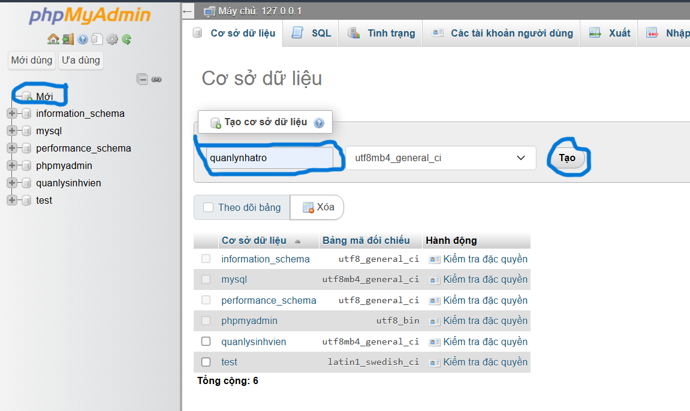

# J2EE_HeThongQuanLyNhaTro
Đồ Án Môn Học ( Quản Lý Nhà Trọ )

Tạo cơ sở dử liệu trong mysql 

1. Tạo Entity
2. Tạo Repository
3. Tạo Service
4. Tạo Controller
5. Tạo View (Templates)
6. Test ứng dụng

!!! GIT PUSH THEO BRANCH CỦA MÌNH KHÔNG GIT LÊN MAIN !!!

CÓ THẮC MẮC Gì CỨ NHẮN TIN THOẢI MÁI TRONG NHÓM 

THANKSSSSSS <3 <3
